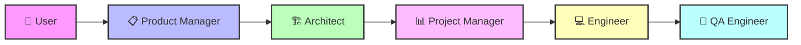
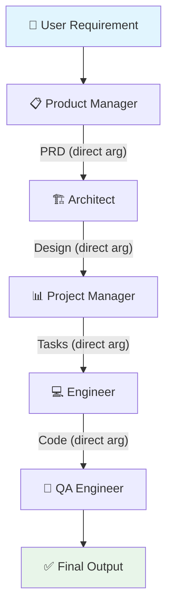
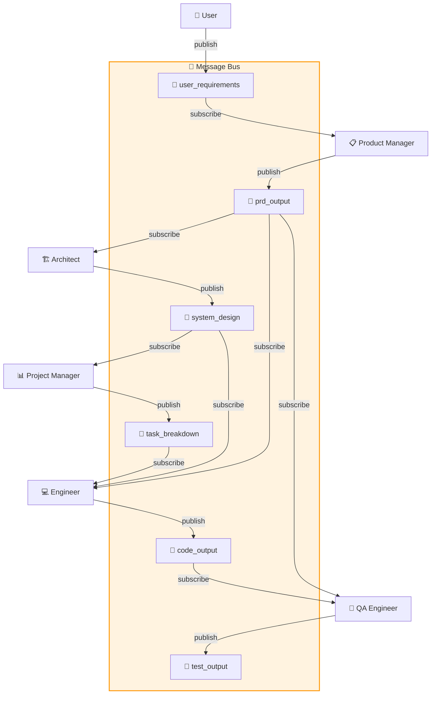
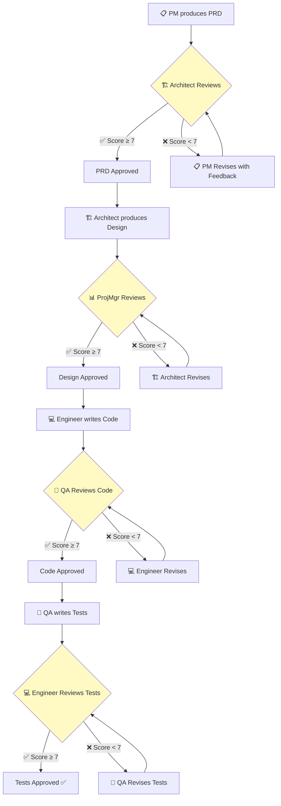
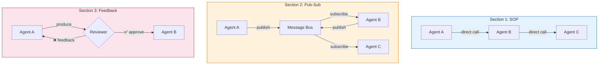

<div align="center">

# 🤖 MetaGPT Multi-Agent Software Development Pipeline

### Implementing Three Core Communication Mechanisms from MetaGPT's Architecture

[](https://www.python.org/)
[](https://openai.com/)
[](https://jupyter.org/)
[](https://requests.readthedocs.io/)
[](LICENSE)

---

*A collaborative project exploring how multi-agent LLM systems communicate, coordinate, and self-improve through structured protocols — inspired by the [MetaGPT](https://github.com/geekan/MetaGPT) framework.*

</div>

---

## 📖 Overview

This project implements a **5-agent software development pipeline** that takes a user requirement and produces a complete software project — including a PRD, system design, task breakdown, code, and tests — all generated by LLM-powered agents.

The **same pipeline** is implemented three times, each using a **different communication mechanism** from MetaGPT's architecture:

| Section | Mechanism | Key Innovation |
|---------|-----------|---------------|
| **Section 1** | Standardized Operating Procedures (SOPs) | Rigid sequential chain with direct data passing |
| **Section 2** | Publish-Subscribe Protocol | Decoupled agents communicating via a shared message bus |
| **Section 3** | Executable Feedback Mechanism | Closed-loop review & revision cycles for quality improvement |

---

## 🏗️ System Architecture

### Agent Roles



| Agent | Input | Output | Schema |
|-------|-------|--------|--------|
| **Product Manager** | User requirement (string) | `PRDDocument` | Goals, stories, requirements, UI draft |
| **Architect** | PRD Document | `SystemDesign` | Tech stack, file list, data structures, call flow |
| **Project Manager** | System Design | `TaskList` | Packages, tasks, logic analysis per file |
| **Engineer** | Tasks + Design + PRD | `CodeOutput` | Filename, code, dependencies (per file) |
| **QA Engineer** | Code + PRD | `TestOutput` | Test filename, test code, review notes |

---

## 📘 Section 1: Standardized Operating Procedures (SOPs)

> **File:** `Section_1_SOP_Pipeline.ipynb`

### Concept

SOPs enforce a **fixed, sequential workflow** where each agent follows a predefined procedure. Data flows **directly** from one agent to the next via function arguments — no intermediary, no events.

### Architecture



### Key Characteristics

| Aspect | Description |
|--------|-------------|
| **Data Flow** | Direct function arguments — `architect.run(prd=prd)` |
| **Coupling** | Tight — each agent knows the previous agent's output |
| **Error Handling** | Retry with same prompt (up to 3 attempts) |
| **Flexibility** | Low — fixed pipeline order, no skipping or branching |
| **Audit Trail** | None — outputs are transient in memory |

### Core Classes

- `BaseAgent` — Shared prompt → LLM → parse → validate → dataclass workflow
- `ProductManager`, `Architect`, `ProjectManager`, `Engineer`, `QAEngineer` — Role-specific agents
- `SOPPipeline` — Orchestrator that calls agents in fixed sequence

---

## 📗 Section 2: Publish-Subscribe Communication Protocol

> **File:** `Section_2_PubSub_Protocol.ipynb`

### Concept

Agents communicate through a **shared Message Bus** using topic-based pub-sub. Each agent **subscribes** to topics it needs and **publishes** its output to a topic. Agents are **fully decoupled** — they don't know who produces or consumes messages.

### Architecture



### Topic Subscription Map

| Agent | Subscribes To | Publishes To |
|-------|--------------|-------------|
| Product Manager | `user_requirements` | `prd_output` |
| Architect | `prd_output` | `system_design` |
| Project Manager | `system_design` | `task_breakdown` |
| Engineer | `task_breakdown`, `prd_output`, `system_design` | `code_output` |
| QA Engineer | `code_output`, `prd_output` | `test_output` |

### Key Characteristics

| Aspect | Description |
|--------|-------------|
| **Data Flow** | Topic-based — agents read from bus, not from each other |
| **Coupling** | Loose — agents only know topic names, not other agents |
| **Error Handling** | Retry with same prompt (up to 3 attempts) |
| **Flexibility** | High — easy to add/remove agents without breaking the chain |
| **Audit Trail** | ✅ Full `MessageBus` history with timestamps, senders, topics |

### Core Classes

- `Message` — Structured envelope (id, sender, topic, content, timestamp, metadata)
- `MessageBus` — Central broker with subscribe, publish, get_latest, and history tracking
- `PubSubAgent` — Base class with `listen()`, `announce()`, and `process()` methods
- `PubSubPipeline` — Orchestrator that seeds the bus and triggers agents

---

## 📕 Section 3: Executable Feedback Mechanism

> **File:** `Section_3_Feedback_Mechanism.ipynb`

### Concept

After each agent produces output, a **different agent reviews it** and provides structured feedback (score, issues, suggestions). If the output doesn't meet quality standards (score < 7), it is **sent back for revision**. This creates a **closed-loop quality improvement** system.

### Architecture



### Review Matrix

| Stage | Producer | Reviewer | What's Evaluated |
|-------|----------|----------|-----------------|
| PRD Review | Product Manager | Architect | Technical feasibility & completeness |
| Design Review | Architect | Project Manager | Implementability & structure |
| Code Review | Engineer | QA Engineer | Bugs, missing logic, quality |
| Test Review | QA Engineer | Engineer | Test coverage & correctness |

### FeedbackResult Schema

```python
@dataclass
class FeedbackResult:
    approved: bool       # True if score >= 7
    score: int           # 1-10 quality rating
    issues: list         # ["issue1", "issue2"]
    suggestions: list    # ["suggestion1", "suggestion2"]
    summary: str         # Overall assessment
```

### Key Characteristics

| Aspect | Description |
|--------|-------------|
| **Data Flow** | Direct args + structured feedback objects |
| **Coupling** | Moderate — producer-reviewer pairs are defined |
| **Error Handling** | Revision loop (up to 2 revisions per stage) |
| **Flexibility** | Medium — review pairs can be reconfigured |
| **Audit Trail** | ✅ Full feedback history with scores, issues per revision |
| **Quality** | Highest — iterative refinement catches and fixes issues |

### Core Classes

- `FeedbackResult` — Structured review output (approved, score, issues, suggestions)
- `FeedbackAgent` — Base class with `produce()`, `review()`, `revise()`, and `run_with_feedback()` 
- `FeedbackPipeline` — Orchestrator that runs produce→review→revise loops at each stage

---

## 🔄 Mechanism Comparison



| Feature | Section 1 (SOP) | Section 2 (Pub-Sub) | Section 3 (Feedback) |
|---------|----------------|---------------------|---------------------|
| **Communication** | Direct function calls | MessageBus topics | Direct + review loop |
| **Agent Coupling** | Tight | Loose | Moderate |
| **Data Passing** | Function arguments | Topic messages | Args + feedback objects |
| **Quality Control** | None (one-shot) | None (one-shot) | Review & revision |
| **Audit Trail** | ❌ None | ✅ Message history | ✅ Feedback history |
| **Extensibility** | Low | High | Medium |
| **Output Quality** | Baseline | Baseline | Improved via revisions |
| **API Calls** | Fewest (~7-10) | Same (~7-10) | Most (~15-25) |

---

## 🛠️ Technology Stack

<div align="center">

[](https://www.python.org/)
[](https://openai.com/)
[](https://jupyter.org/)
[](https://requests.readthedocs.io/)
[](https://www.json.org/)
[](https://docs.python.org/3/library/dataclasses.html)

</div>

| Component | Technology | Purpose |
|-----------|-----------|---------|
| **Language** | Python 3.10+ | Core implementation |
| **LLM** | OpenAI GPT-3.5-Turbo | Agent reasoning & generation |
| **HTTP Client** | `requests` library | API calls (no SDK dependency) |
| **Notebooks** | Jupyter Notebook | Interactive execution & visualization |
| **Schemas** | Python `dataclasses` | Structured output validation |
| **Serialization** | JSON | LLM input/output format |
| **Patterns** | Pub-Sub, Observer, Chain of Responsibility | Communication mechanisms |

---

## 📂 Project Structure

```
Mid Term/
├── README.md                              # This file
├── Section_1_SOP_Pipeline.ipynb           # Mechanism 1: SOPs
├── Section_2_PubSub_Protocol.ipynb        # Mechanism 2: Pub-Sub
├── Section_3_Feedback_Mechanism.ipynb     # Mechanism 3: Feedback
└── readme.txt                             # Assignment notes
```

---

## 🚀 Getting Started

### Prerequisites

```bash
pip install requests jupyter
```

### Running a Notebook

1. Set your OpenAI API key in **Cell 1** of any notebook:
   ```python
   API_KEY = "your-openai-api-key-here"
   ```

2. Open the notebook:
   ```bash
   jupyter notebook "Section_1_SOP_Pipeline.ipynb"
   ```

3. **Run All Cells** (`Kernel → Restart & Run All`)

4. The pipeline will execute all 5 stages and display:
   - PRD, System Design, Task Breakdown
   - Generated code files
   - Test files and review notes
   - Communication/feedback audit trail (Sections 2 & 3)

---

## 📊 Sample Output

Each notebook produces a complete software project. Example with prompt *"Create a classic and simple Flappy Bird game"*:

| Stage | Output | Description |
|-------|--------|-------------|
| 1 | PRD | 3 product goals, 5 user stories, competitive analysis |
| 2 | System Design | Pygame-based architecture, 4-5 files, class definitions |
| 3 | Task List | Package dependencies, per-file logic analysis |
| 4 | Code | Complete Python files (game.py, bird.py, obstacle.py, etc.) |
| 5 | Tests | Unit test files with pytest, code review notes |

---

## 🧠 Key Takeaways

1. **SOPs** are simplest but inflexible — good for well-defined workflows with no ambiguity
2. **Pub-Sub** enables loose coupling — agents can be added/removed/replaced without breaking the pipeline
3. **Feedback loops** produce the highest quality output — but at the cost of more API calls and time
4. In practice, MetaGPT **combines all three**: SOPs define the workflow, pub-sub enables communication, and feedback ensures quality

---

## 👥 Team

| Member | Section | Mechanism |
|--------|---------|-----------|
| Person 1 | Section 1 | Standardized Operating Procedures |
| Sahil Kasliwal | Section 2 | Publish-Subscribe Protocol |
| Person 3 | Section 3 | Executable Feedback Mechanism |

---

<div align="center">

*Built as part of the DAMG GenAI Mid-Term Project — exploring multi-agent LLM architectures.*

</div>
