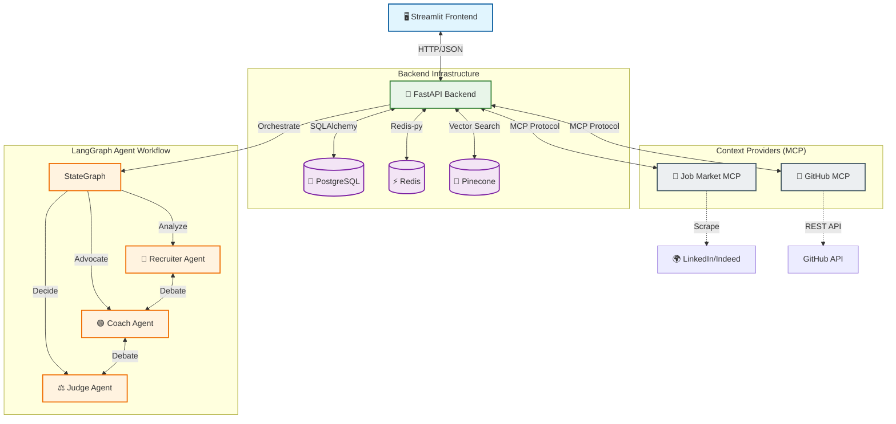

# 🎯 Jobzilla AI - AI-Powered Job Application Intelligence


Jobzilla AI is a comprehensive intelligent assistant designed to be your personalized job search and application companion. Built on a modern microservices architecture with Medallion data pipeline (Bronze-Silver-Gold), this application leverages cutting-edge AI technologies for semantic job matching, multi-agent analysis, and automated application generation. Powered by OpenAI GPT-4, LangGraph agents, and vector embeddings, it helps job seekers discover relevant opportunities, analyze job-candidate fit through AI debate, generate personalized cover letters, and integrate GitHub portfolios—all tailored to your specific skills, experience, and career goals.

---
## ✍️ Authors
1. Hrishi Pal
2. Inchara Adigante
3. Sahil Kasliwal

---
## 📝 Project Evolution:
Here is a logging of our Project on weekly basis

📂 https://shorturl.at/OjOAG

---
## 🏗️ System Architecture



## 💻 Technologies and Tools


## ✨ Key Features

### 🤖 Multi-Agent Debate
Instead of a simple "match score," three AI agents debate your candidacy:
- **🔴 The Recruiter**: Plays devil's advocate, finding every weakness in your profile.
- **🟢 The Career Coach**: Advocates for you, highlighting transferable skills and potential.
- **⚖️ The Judge**: Weighs both sides and gives a final, unbiased verdict.

### 🔍 Semantic Job Search
Forget keyword matching. Jobzilla uses **Vector Embeddings (OpenAI)** to understand the *meaning* of your resume and finds jobs that match your actual skills, not just keywords.

### 📝 Intelligent Cover Letters
Generates hyper-personalized cover letters that:
- Address specific requirements in the job description
- Highlight your most relevant projects
- Adopt the company's tone and culture

### 🐙 GitHub Portfolio Analysis
Connects to your GitHub via **MCP Server** to analyze your code quality, languages, and contributions, adding "hard proof" of your skills to your profile.

## ⚙️ Setup Instructions (Step-by-Step Guide)

### 1. Clone the Repository
```bash
git clone https://github.com/sahilk710/jobzilla-ai.git
cd jobzilla-ai
```

### 2. Configure Environment
Create a `.env` file in the root directory (use `.env.example` if available, or ask the developer).

### 3. Run with Docker
The system uses Docker Compose to manage all services (Backend, Frontend, Database, Redis, etc.) seamlessly.
```bash
docker-compose up -d --build
```

### 4. Access the Application
- **Frontend**: [http://localhost:8501](https://killmatch-frontend-95714121537.us-central1.run.app/)
- **Backend API Docs**: [http://localhost:8000/docs](https://killmatch-backend-95714121537.us-central1.run.app/docs)
- **Job Market MCP**: https://killmatch-mcp-jobmarket-95714121537.us-central1.run.app/docs
- **Github Market MCP**: [https://killmatch-mcp-jobmarket-95714121537.us-central1.run.app/docs](https://killmatch-mcp-github-95714121537.us-central1.run.app/docs)
- **Airflow**: http://localhost:8080

---

## � Project Structure

```
jobzilla-ai/
├── backend/            # FastAPI Application
│   ├── app/
│   │   ├── agents/     # LangGraph Agent Definitions
│   │   ├── api/        # API Routes
│   │   └── models/     # Pydantic Models
├── frontend/           # Streamlit Application
├── mcp_servers/        # External Data Connectors
│   ├── github-context/ # GitHub API Connector
│   └── job-market/     # LinkedIn/Indeed Scraper
├── airflow/            # Scheduled Tasks (DAGs)
└── docker-compose.yml  # Infrastructure Definition
```

---

## 🤝 Contributing

1. Fork the repository
2. Create feature branch (`git checkout -b feature/amazing-feature`)
3. Commit changes (`git commit -m 'Add amazing feature'`)
4. Push to branch (`git push origin feature/amazing-feature`)
5. Open a Pull Request

---

*Powered by Caffeine and LLMs ☕🤖*
