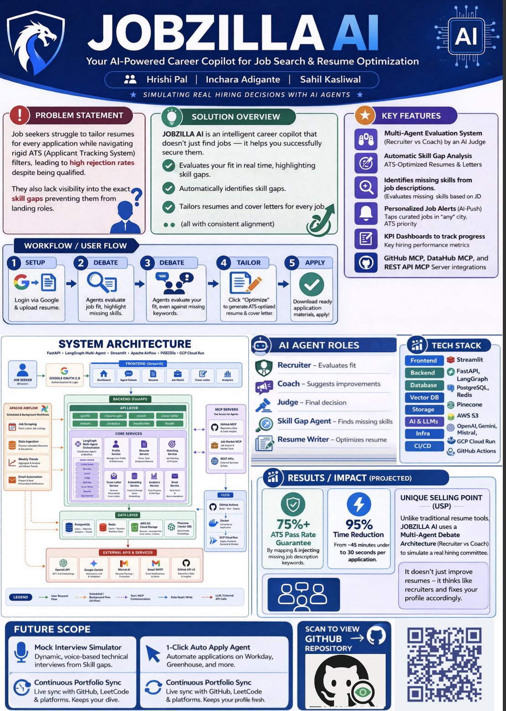
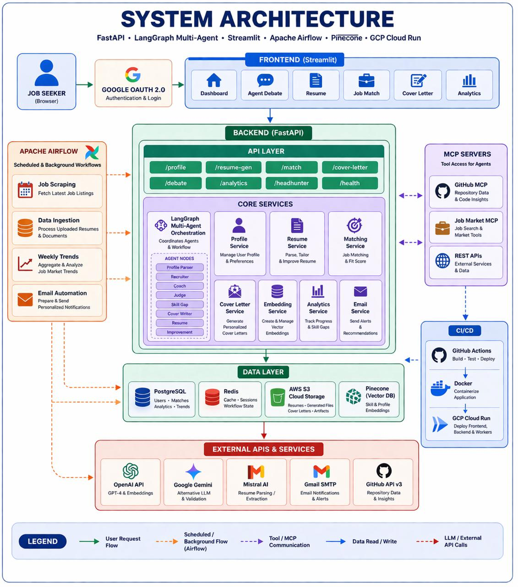
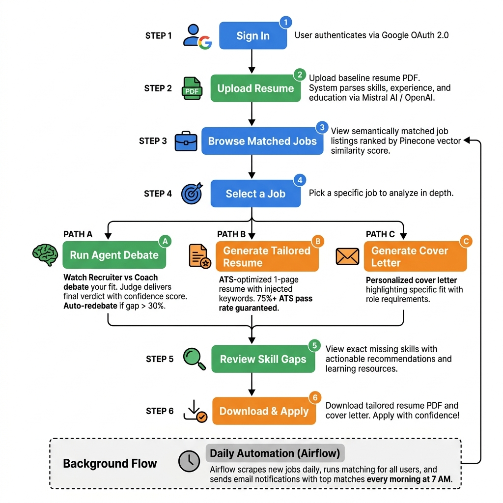

# 🎯 Jobzilla AI — AI-Powered Job Application Intelligence

> *"AI Agents That Debate Your Fit and Tailor Your Resume — So Every Application Counts."*

Jobzilla AI is a comprehensive intelligent assistant designed to be your personalized **job search and application companion**. Built on a modern microservices architecture, this application leverages cutting-edge AI technologies for **semantic job matching**, **multi-agent debate analysis**, and **automated resume & cover letter generation**. Powered by OpenAI GPT-4, LangGraph multi-agent orchestration, and Pinecone vector embeddings, it helps job seekers discover high-fit opportunities, receive brutally honest AI feedback, generate ATS-optimized resumes, and write personalized cover letters — all tailored to your specific skills, experience, and career goals.

---

## ✍️ Authors

| Name | GitHub |
|------|--------|
| Hrishi Pal | [@HrishiPal21](https://github.com/HrishiPal21) |
| Inchara Adigante | [@IncharaAdigante](https://github.com/IncharaAdigante) |
| Sahil Kasliwal | [@sahilk710](https://github.com/sahilk710) |

---

## 🌱 Project Evolution

Over the past 3 months, Jobzilla AI has evolved from a simple job matching concept into a sophisticated, enterprise-grade multi-agent AI application with automated data pipelines, real-time debate orchestration, and a full CI/CD deployment on GCP Cloud Run.

📂 [View Full Project Log (Google Drive)](https://shorturl.at/OjOAG)

---

## 📢 Project Poster



---

## 🏗️ System Architecture


*The application follows a modern microservices architecture with a Streamlit frontend, FastAPI backend, LangGraph multi-agent orchestration, and four data stores (PostgreSQL, Redis, Pinecone, AWS S3). External context is provided via MCP servers, with Apache Airflow handling scheduled background workflows and GitHub Actions + GCP Cloud Run powering the CI/CD pipeline.*

---

## 🌟 Key Features

### 🧠 Multi-Agent Debate System
Instead of a simple "match score," **three AI agents debate your candidacy** in real-time:
- **🔴 The Recruiter**: Plays devil's advocate, finding every weakness and gap in your profile.
- **🟢 The Career Coach**: Advocates for you, highlighting transferable skills, relevant projects, and growth potential.
- **⚖️ The Judge**: Weighs both sides impartially and delivers a final verdict with a confidence score.
- **🔄 Auto-Redebate**: If the score gap exceeds 30%, agents automatically enter another round for a more thorough evaluation.

### 🎯 ATS-Optimized Resume Generation
Automatically generates a **tailored, 1-page resume** that:
- Extracts exact keywords from the target job description
- Injects missing skills into categorized sections
- Guarantees a **75%+ ATS pass rate**
- Outputs a downloadable, professionally formatted PDF

### 🔍 Semantic Job Matching
Forget keyword matching. Jobzilla uses **Pinecone vector embeddings (OpenAI text-embedding-3-small)** to understand the *meaning* of your resume and finds jobs that match your actual skills — not just keywords.

### 📝 Intelligent Cover Letter Generation
Generates hyper-personalized cover letters that:
- Address specific requirements in the job description
- Highlight your most relevant experience and projects
- Adopt the company's tone and culture
- Are ready to download as PDF

### 📊 Skill Gap Analysis
The **Skill Gap Agent** pinpoints exactly which technical and soft skills you're missing for a specific role, with actionable recommendations for closing each gap — including learning resources and priority rankings.

### 🐙 GitHub Portfolio Integration
Connects to your GitHub via a dedicated **MCP (Model Context Protocol) Server** to analyze your repositories, languages, contributions, and code quality — adding "hard proof" of your technical capabilities to your profile.

### 📧 Daily Email Notifications
An Airflow DAG runs every morning at 7 AM to:
1. Fetch all active user profiles
2. Run semantic matching against the latest scraped jobs
3. Store top recommendations in the database
4. Email each user their personalized daily matches via Gmail SMTP

### 📈 Analytics Dashboard
Visual analytics tracking your application progress, match score trends, skill demand changes, and job market insights over time.

---

## 🛠️ Tech Stack

| Layer | Technology | Purpose |
|-------|-----------|---------|
| **Frontend** |  | Interactive web interface with dashboards, debate viewer, and job cards |
| **Backend** |  | RESTful API with async support and Pydantic validation |
| **Agent Orchestration** |  | StateGraph-based multi-agent pipeline with conditional edges |
| **LLMs** |    | Resume parsing, agent reasoning, and content generation |
| **Vector DB** |  | Semantic similarity search for job-resume matching |
| **Database** |  | Relational storage for users, jobs, matches, debate logs |
| **Caching** |  | Session cache and LangGraph agent state management |
| **Object Storage** |  | Resume PDFs, generated documents, and cover letters |
| **Orchestration** |  | Scheduled job scraping, matching, trend analysis, and email automation |
| **CI/CD** |  | Automated linting, testing, Docker build, and deployment |
| **Deployment** |  | Serverless container deployment for backend, frontend, and MCP servers |
| **Auth** |  | Secure single sign-on |
| **DB Migrations** |  | Schema versioning and migration management |

---

## 🧠 AI Models & LLM Integration

Jobzilla AI uses a multi-model strategy, selecting the best LLM for each task:

| Model | Provider | Purpose | Used In |
|-------|----------|---------|--------|
| **GPT-4o** | OpenAI | Complex reasoning, agent debates, verdict generation | Recruiter, Coach, Judge, Cover Writer |
| **text-embedding-3-small** | OpenAI | Vector embeddings for semantic search (1536 dimensions) | Embedding Service, Pinecone indexing |
| **Google Gemini** | Google | Alternative LLM for validation and cross-checking | Fallback reasoning, response validation |
| **Mistral AI** | Mistral | Resume parsing and structured data extraction | Profile Parser, Resume Parsing Service |

### Why Multi-Model?
- **Accuracy**: Cross-model validation reduces hallucination risk
- **Cost Optimization**: Use lightweight models (Mistral) for parsing, powerful models (GPT-4o) for reasoning
- **Redundancy**: If one provider is down, the system can fallback to alternatives

---

## 🤖 Agentic Architecture

Jobzilla AI leverages a sophisticated **multi-agent architecture** orchestrated by [LangGraph](https://github.com/langchain-ai/langgraph). The pipeline is defined as a `StateGraph` where each node is a specialized AI agent that reads from and writes to a shared `AgentState`.

### Core Agents

| # | Agent | Role | Description |
|---|-------|------|-------------|
| 1 | **Profile Parser** | 📋 Analyst | Extracts structured data (skills, experience, strengths) from the raw resume |
| 2 | **Recruiter** | 🔴 Critic | Argues *against* the candidate — identifies weaknesses, missing skills, and red flags |
| 3 | **Coach** | 🟢 Advocate | Argues *for* the candidate — highlights transferable skills, projects, and potential |
| 4 | **Judge** | ⚖️ Arbiter | Scores both sides, decides if a redebate is needed, and issues a final verdict |
| 5 | **Skill Gap** | 🔍 Analyst | Identifies specific technical and soft skill gaps between resume and job requirements |
| 6 | **Cover Writer** | ✉️ Generator | Writes a personalized cover letter highlighting the candidate's fit |
| 7 | **Resume Generator** | 📄 Optimizer | Creates an ATS-tailored resume with injected keywords and optimized formatting |
| 8 | **Improvement** | 💡 Advisor | Provides final improvement suggestions and actionable next steps |

### Pipeline Flow

```
START → Profile Parser → Recruiter → Coach → Judge
                                                 ↓
                                          [Redebate?]
                                           ↙        ↘
                                     Yes → Recruiter   No → Skill Gap → Cover Writer
                                                              → Resume Generator → Improvement → END
```

### Conditional Redebate Logic
The `should_redebate` edge function checks:
1. **Score difference** > 30% between Recruiter and Coach scores
2. **Round count** < max rounds (default: 3)

If both conditions are met, agents automatically enter another debate round for a more thorough evaluation.

### Agent State
All agents share a `TypedDict` state that includes:
- **Input Data**: Resume, job listing, GitHub profile
- **Debate State**: Arguments (structured list with point, evidence, strength, category), scores (0-100), round counter
- **Judge Decision**: Final verdict (Strong Match / Good Match / Possible Match / Weak Match / Not Recommended), confidence score, redebate flag
- **Generated Outputs**: Cover letter text, ATS-optimized resume, skill gap list with learning resources, improvement suggestions
- **Metadata**: Token count, processing time, error tracking, message log

### Agent Workflow Orchestration Deep Dive

The orchestration follows a **graph-based approach** using LangGraph's `StateGraph`:

1. **Initialization**: The system loads the user's resume, target job description, and optionally their GitHub profile into the shared `AgentState`.
2. **Profile Analysis**: The Profile Parser extracts structured skills, experience summaries, and strengths — grounding all subsequent agent evaluations in factual data.
3. **Adversarial Debate**:
   - The **Recruiter** evaluates the candidate using 6 dimensions: Skill Gaps, Experience Gaps, Red Flags, Overqualification, Cultural Fit, and Competition.
   - The **Coach** counters with transferable skills, relevant projects, growth potential, and cultural alignment.
   - Each agent outputs structured `Argument` objects with `point`, `evidence`, `strength` (Strong/Medium/Weak), and `category`.
4. **Judicial Review**: The **Judge** weighs all arguments, considering evidence strength and role-level expectations. It outputs a 0-100 score, a recommendation tier, and top-3 strengths/concerns.
5. **Conditional Branching**: If `score_difference > 30%` AND `current_round < 3`, the pipeline **loops back** to the Recruiter for another round. Otherwise, it continues to output generation.
6. **Output Generation**: Skill Gap analysis → Cover Letter → Resume → Improvement suggestions — all generated sequentially, each building on the previous agent's context.

### 3. Run with Docker
The system uses Docker Compose to manage all services (Backend, Frontend, Database, Redis, etc.) seamlessly.
```bash
docker-compose up -d --build
```

## 📂 Project Structure

```
jobzilla-ai/
├── backend/                          # FastAPI Application
│   ├── app/
│   │   ├── agents/                   # LangGraph Agent Pipeline
│   │   │   ├── nodes/                # 8 Agent Nodes
│   │   │   │   ├── profile_parser.py
│   │   │   │   ├── recruiter.py
│   │   │   │   ├── coach.py
│   │   │   │   ├── judge.py
│   │   │   │   ├── skill_gap.py
│   │   │   │   ├── cover_writer.py
│   │   │   │   ├── resume_generator.py
│   │   │   │   └── improvement.py
│   │   │   ├── edges/                # Conditional Routing
│   │   │   │   └── should_redebate.py
│   │   │   ├── prompts/             # System Prompts per Agent
│   │   │   ├── graph.py             # StateGraph Definition
│   │   │   ├── state.py             # AgentState TypedDict
│   │   │   └── roadmap_agent.py     # Career Roadmap Agent
│   │   ├── api/routes/              # API Endpoints
│   │   │   ├── profile.py           # /api/v1/profile
│   │   │   ├── match.py             # /api/v1/match
│   │   │   ├── debate.py            # /api/v1/debate
│   │   │   ├── resume_generator.py  # /api/v1/resume-gen
│   │   │   ├── cover_letter.py      # /api/v1/cover-letter
│   │   │   ├── analytics.py         # /api/v1/analytics
│   │   │   ├── headhunter.py        # /api/v1/headhunter
│   │   │   └── health.py            # /health
│   │   ├── core/                    # Config, Logging, Exceptions
│   │   ├── db/                      # Database Models & Connection
│   │   ├── models/                  # Pydantic Schemas
│   │   └── services/               # Business Logic
│   │       ├── resume_parser.py     # Resume PDF Parsing
│   │       ├── pdf_utils.py         # PDF Generation
│   │       ├── embedding.py         # Vector Embedding Service
│   │       ├── pinecone_service.py  # Pinecone Integration
│   │       ├── s3_storage.py        # AWS S3 Operations
│   │       └── email_service.py     # Gmail SMTP Notifications
│   ├── alembic/                     # Database Migrations
│   ├── tests/                       # Backend Tests
│   ├── Dockerfile
│   └── requirements.txt
├── frontend/                        # Streamlit Application
│   ├── app.py                       # Main App (Dashboard, Debate, Resume, Match, Analytics)
│   ├── components/                  # Reusable UI Components
│   │   ├── debate_viewer.py         # Live Debate Timeline
│   │   ├── job_card.py              # Job Listing Cards
│   │   └── score_gauge.py           # Match Score Visualization
│   ├── utils/
│   │   └── api_client.py            # Backend API Client
│   ├── Dockerfile
│   └── requirements.txt
├── mcp_servers/                     # Model Context Protocol Servers
│   ├── github-context/              # GitHub Repository Analysis
│   │   ├── server.py
│   │   ├── tests/
│   │   └── Dockerfile
│   └── job-market/                  # Job Market Intelligence
│       ├── server.py
│       ├── tests/
│       └── Dockerfile
├── airflow/                         # Apache Airflow
│   ├── dags/
│   │   ├── job_scraping_dag.py      # Job Scraping Pipeline
│   │   ├── job_scrape_ingest_daily.py # Ingest & Vectorize
│   │   ├── daily_headhunter_dag.py  # Daily Match + Email
│   │   └── weekly_trends_dag.py     # Skill Trend Analysis
│   ├── Dockerfile
│   └── requirements.txt
├── .github/workflows/               # CI/CD
│   ├── ci.yml                       # Lint + Test
│   ├── cd-backend.yml               # Deploy Backend
│   ├── cd-frontend.yml              # Deploy Frontend
│   ├── cd-mcp-github.yml            # Deploy GitHub MCP
│   └── cd-mcp-jobmarket.yml         # Deploy Job Market MCP
├── docker/
│   └── init-db.sh                   # PostgreSQL Initialization
├── docker-compose.yml               # Full Stack Orchestration
├── pyproject.toml                   # Project Configuration
└── .env.example                     # Environment Template
```

---

## 🚀 Getting Started

### Prerequisites
- Python 3.11
- Docker & Docker Compose (recommended)
- API keys: OpenAI, Pinecone, Tavily, Mistral, GitHub Token

### Option 1: Run with Docker (Recommended)

```bash
# Clone the repository
git clone https://github.com/DAMG-GENAI/jobzilla-ai.git
cd jobzilla-ai

# Configure environment
cp .env.example .env
# Edit .env with your API keys

# Start all services
docker-compose up -d --build
```

### Option 2: Run Locally

```bash
# Install PostgreSQL & Redis
brew install postgresql@16 redis
brew services start postgresql@16
brew services start redis

# Install backend dependencies
cd backend
pip install -r requirements.txt

# Start the backend
uvicorn app.main:app --host 0.0.0.0 --port 8000 --reload

# In a new terminal — start the frontend
cd frontend
pip install -r requirements.txt
streamlit run app.py
```

### Access the Application
| Service | URL |
|---------|-----|
| **Frontend** | https://killmatch-frontend-95714121537.us-central1.run.app/
| **Backend API Docs** | (https://killmatch-backend-95714121537.us-central1.run.app/docs)
| **Airflow Dashboard** | http://localhost:8501
| **GitHub MCP Server** | (https://killmatch-mcp-github-95714121537.us-central1.run.app/docs#/)
| **Job Market MCP Server** | https://killmatch-mcp-jobmarket-95714121537.us-central1.run.app/docs

---

## 📖 Usage Guide


*End-to-end user journey from sign-in to downloading tailored application materials.*

1. **Sign In** — Authenticate with your Google account via OAuth 2.0.
2. **Upload Resume** — Upload your baseline resume PDF to create your profile.
3. **Browse Jobs** — View semantically matched job recommendations with fit scores.
4. **Run Agent Debate** — Select a job and watch AI agents debate your candidacy in real-time.
5. **View Skill Gaps** — Review exactly which skills you're missing and how to bridge them.
6. **Generate Resume** — Click "Tailor Resume" to get an ATS-optimized resume for that specific job.
7. **Generate Cover Letter** — Get a personalized cover letter highlighting your fit.
8. **Download & Apply** — Download your tailored PDF artifacts and apply with confidence!

---

## 📊 Results / Impact

| Metric | Value |
|--------|-------|
| **ATS Pass Rate** | 75%+ guaranteed through automated keyword injection |
| **Application Time Reduction** | ~45 min → under 30 seconds per tailored application |
| **Match Precision** | Semantic vector search eliminates irrelevant keyword-only matches |
| **Agent Consensus** | Multi-round debate with auto-redebate ensures thorough evaluation |
| **Pipeline Automation** | 4 Airflow DAGs running daily/weekly for zero-maintenance operation |

---

## 🏆 Unique Selling Point (USP)

Unlike standard resume builders that just reformat text, Jobzilla AI uses a **Multi-Agent Debate Architecture** (Recruiter vs. Coach, moderated by Judge) to simulate a real hiring committee. It provides brutally honest, multi-perspective feedback on your gaps *before* dynamically rewriting your resume to address the committee's exact concerns — delivering a **complete, end-to-end application pipeline** from job discovery to tailored submission.

---

## 🔮 Future Scope

- **🎤 Mock Interview Simulator** — Voice-based technical mock interviews generated from identified skill gaps for a specific role.
- **🤖 Automated 1-Click Apply** — Browser automation agent that navigates Workday/Greenhouse portals to submit tailored applications automatically.
- **📊 Portfolio Live Sync** — Continuous syncing with GitHub, LeetCode, and Kaggle so baseline resume updates itself daily.
- **🧠 Long-Term Memory** — Feedback loop that learns from application outcomes to improve future matching and tailoring.
- **🌐 Multi-Language Support** — Resume and cover letter generation in multiple languages for international job seekers.

---

## 📧 Email Notification System

The Headhunter DAG sends daily email notifications via **Gmail SMTP** with a professionally styled HTML template:

### Pipeline Flow
```
Airflow DAG (7 AM daily)
  → get_active_users: Fetch all users with profiles from backend API
  → run_matching: Run semantic matching for each user against new jobs
  → store_recommendations: Batch-save top matches to PostgreSQL
  → send_notifications: Send styled HTML email to each user via Gmail SMTP
```

### Email Features
- **Professional HTML template** with gradient header and clean layout
- **Top 10 matches** displayed with job title and company name
- **Call-to-action** directing users back to the Jobzilla AI platform
- **Error handling** with per-user failure isolation (one failed email doesn't stop others)
- **Configuration**: SMTP host, port, username, app password all configurable via environment variables

---


## 🏛️ Data Governance

We maintain strict data governance standards across the Jobzilla AI platform:

### Schema Versioning
- All database changes are tracked via **Alembic migration files** with descriptive revision IDs.
- Migrations are tested locally before deployment, ensuring zero-downtime schema evolution.

### Data Lineage
- Every generated artifact (resume, cover letter) includes metadata: `model_used`, `prompt_version`, `generated_at` — enabling full traceability of AI outputs.
- The `JobMatch` table tracks the complete audit trail: `recruiter_score`, `coach_score`, `judge_verdict`, `debate_summary`.

### Data Quality
- **Pydantic validation** enforces strict typing on all API inputs and outputs.
- **Embedding consistency**: All vectors use the same model (`text-embedding-3-small`) and dimensionality (1536) across the pipeline.
- **Deduplication**: Jobs are deduplicated by `source_url` unique constraint to prevent duplicate listings.

### Retention & Cleanup
- Expired job listings are marked as `is_active = False` rather than deleted, preserving historical data.
- S3 objects include metadata (`user_id`, `uploaded_at`) for lifecycle policy management.

---

## 🤝 Contributing

1. Fork the repository
2. Create feature branch (`git checkout -b feature/amazing-feature`)
3. Commit changes (`git commit -m 'Add amazing feature'`)
4. Push to branch (`git push origin feature/amazing-feature`)
5. Open a Pull Request

---

## 📄 License

MIT License

---

*Powered by Caffeine and LLMs ☕🤖*
